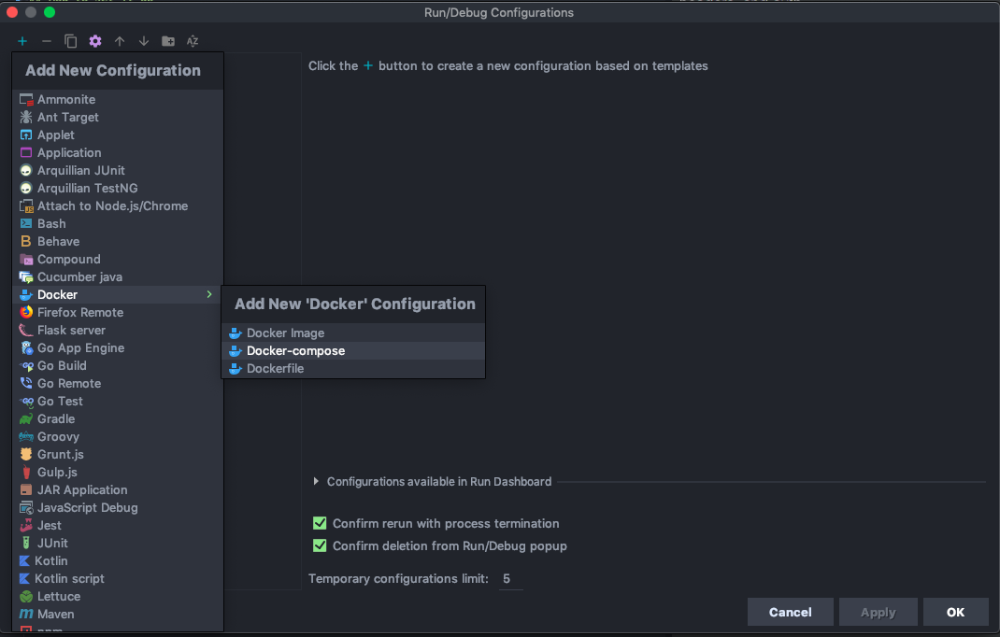
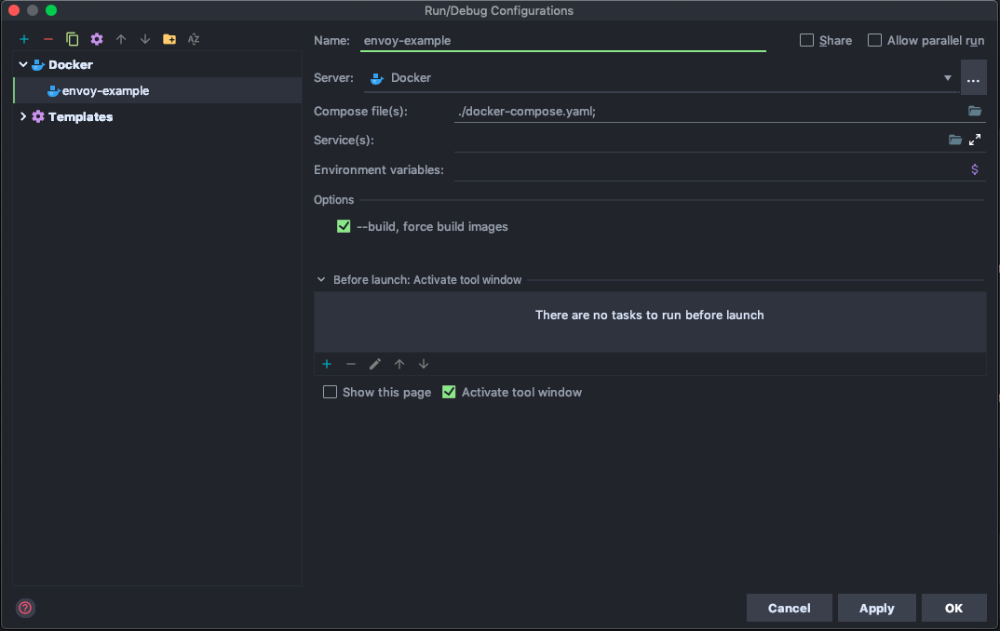

Front-Proxy PoC
=====================

Simple Envoy Service Mesh with External Authorization and Custom Header Injection. 
Showing that Envoy can be used in conjunction with external auth (ext-authz) to 
manage routing, headers, and auth. The two backend services `service/sn-instagram/instagram.go`
and `service/sn-facebook/facebook.go` are placeholders to help demonstrate separation of services
and routing.

## The Call Flow
* Envoy is listening on port 8000
* Checks with extauth (port 4000)
* extauth injects token if valid and removes original auth header
* Endpoint is then hit

extauth is called via gRPC because of how Envoy has decided to implement External Authorization.

## How to set it up
#### 1. Cloning the repository <br>
Make sure you've cloned this repo <b> under your working GOPATH, this is important! </b> 
For example: `~/go/src/simple-envoy-service-mesh`.

#### 2. Setup Docker-compose Run Config <br>
Next, we want to edit our `Run/Debug Configurations`. Click on Add Configuration. <br><br>
 <br><br>
Then we want to add a new configuration of Docker Compose under `+ > Docker > Docker-compose`. These run configs 
allow us to start the container quickly through IntelliJ.<br><br>
 <br><br>
Fill in the details as follows. Select the `docker-compose.yaml` file for the field `Compose File(s)`. No
 need to worry about requirements as the Dockerfiles take care of that on first run. <br><br>
 <br><br>
Done! Now you can run the service.

#### 3.1. Running the service 
To run the entire service, we can just let IntelliJ handle it for us and 
run it through the Run Config we created earlier. Select `envoy-example` from the dropdown menu and press `Run`!<br><br>
 <br><br>
You can then test the service with a curl command. 
This, as an example, would hit the Instagram service and get the post for that member ID
```bash
curl -X GET \
  http://localhost:8000/instagram/get_post/1 \
  -H 'Authorization: Bearer 1'
```
It should return a response like this
```
Hello from the Instagram service! Fetching post with ID "1"
Finding test header value: "some test token"
```
Similarly, Facebook can be hit by changing the service name.
```bash
curl -X GET \
  http://localhost:8000/facebook/get_post/1 \
  -H 'Authorization: Bearer 1'
```
```
Hello from the Facebook service! Fetching post with ID "1"
Finding test header value: "some test token"
```